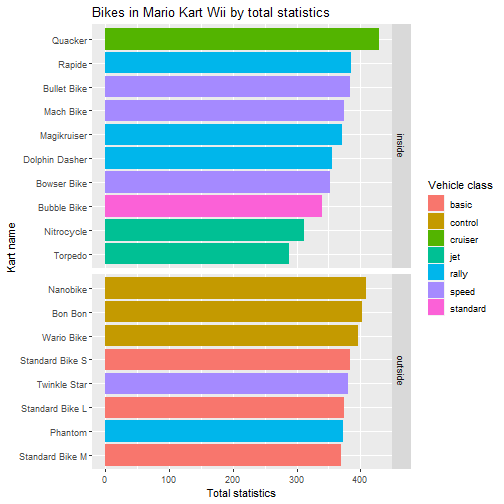

Course Project: Shiny Application and Reproducible Pitch
========================================================
author: Gazi Tarique Mahmud
date: 16th January 2022
autosize: true

========================================================

# Assignment
This is the final assignment of the Developing Data Products Course from Johns Hopkins University Data Science Specialization. This is the scope:

1. Write a shiny application with associated supporting documentation. 
2. Deploy the application on Rstudio’s shiny server
3. Share the application link by pasting it into the provided text box
4. Share your server.R and ui.R code on github

========================================================
# Dataset
I have used a standard R dataset, called mtcars.

```r
devtools::install_github("aldomann/mariokart")
library(mariokart)
head(mkwii_vehicles)
```

```
          vehicle vehicle_type vehicle_class drift_type weight_class speed
1     Aero Glider         kart           jet       none        heavy 86.25
2   B Dasher Mk 2         kart           jet       none       medium 80.00
3     Flame Flyer         kart         speed       none        heavy 77.50
4     Blue Falcon         kart           jet       none        light 75.00
5       Wild Wing         kart         speed       none       medium 71.25
6 Piranha Prowler         kart      standard       none        heavy 68.75
  weight acceleration handling drift off_road mini_turbo
1  70.00        26.25    21.25 33.75    20.00      20.00
2  60.00        33.75    30.00 46.25    26.25      30.00
3  73.75        20.00    26.25 60.00    22.50      60.00
4  36.25        43.75    36.25 53.75    30.00      30.00
5  63.75        26.25    36.25 73.75    30.00      73.75
6  83.75        36.25    43.75 43.75    37.12      33.75
```


========================================================

# Algorithm

The “algorithm” is simple and runs the linear model function.


```r
library(mariokart)
library(ggplot2)
library(dplyr)
data(mkwii_vehicles)
data(mkwii_characters)
data(mk8_vehicles)
select_values <- colnames(mkwii_characters)
select_values <- select_values[! select_values %in% c('Character', 'Class')] 
```

========================================================

# Output: 



Please, [Click here to access the shiny webapp](https://gtarique.shinyapps.io/shinyApp/)
